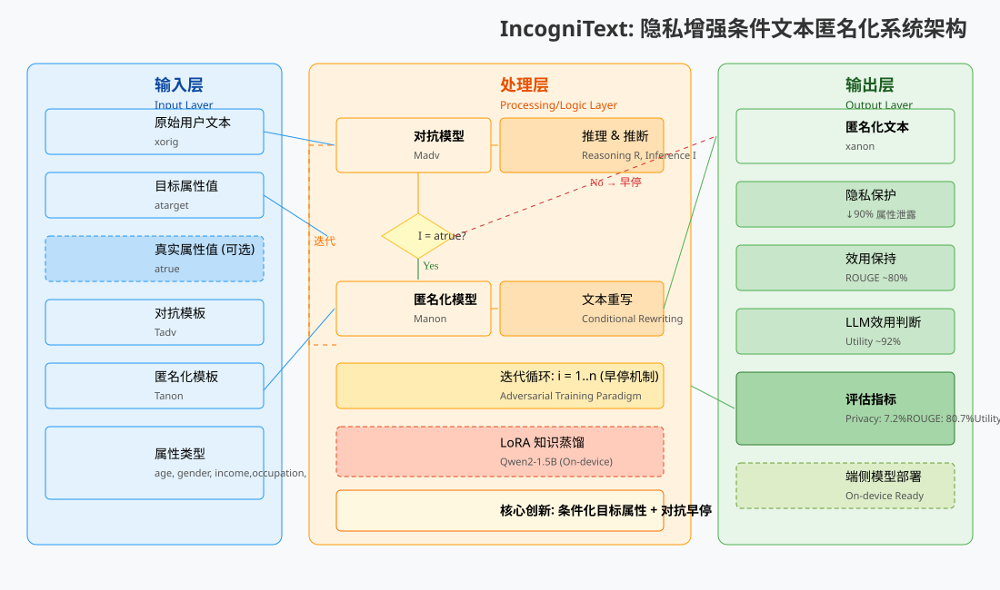

# IncogniText: 隐私增强条件文本匿名化



---

## 一、第一遍阅读：快速结构理解 (First Pass)

### 1.1 论文类型

**系统论文 (System Paper)** - 提出一个完整的文本匿名化系统 IncogniText，包含算法设计、实验验证和端侧部署方案。

### 1.2 核心贡献

1. **条件化目标属性匿名化**: 通过预设错误目标属性值 $a_{target}$ 误导攻击者，而非简单删除/抽象化敏感信息
2. **对抗式迭代机制**: 利用对抗模型 $M_{adv}$ 作为早停信号，兼顾隐私保护与效用保持
3. **多来源信息融合**: 可选地利用真实属性值 $a_{true}$ 和对抗推理 $R$ 增强匿名化质量
4. **端侧模型蒸馏**: 将大模型能力蒸馏到 Qwen2-1.5B + LoRA，实现设备端部署
5. **显著性能提升**: 在8种隐私属性上实现90%+隐私泄露降低

### 1.3 核心解决的问题

- **间接隐私泄露**: 现有方法（PII检测、差分隐私）无法处理需复杂推理+外部知识才能推断的隐私线索
- **效用-隐私权衡**: 差分隐私方法 (DP-BART) 虽能保护隐私但严重损害文本语义
- **攻击者推理能力**: LLM攻击者可通过语法特征、上下文线索推断用户属性

### 1.4 在已有研究中的位置

| 对比方法                     | 本文的改进                           |
| ---------------------------- | ------------------------------------ |
| ALS (Azure Language Service) | 能处理间接泄露，不限于显式PII        |
| DP-BART-PR+                  | 保持高效用 (ROUGE 80% vs 7%)         |
| Dou-SD                       | 重写而非检测-替换，更自然            |
| FgAA (并发工作)              | 条件化目标值 + 早停机制，隐私提升19% |

---

## 二、第二遍阅读：核心内容提炼 (Second Pass)

### 2.1 整体框架

```
Input → [Adversarial Model] → Inference(I) + Reasoning(R)
                ↓ (if I = atrue)
         [Anonymization Model] → x_anon
                ↓ (iterate until I ≠ atrue or max_iter)
         Output: Anonymized Text
```

**Algorithm 1 核心流程**:

1. 初始化 $x^{anon}_0 = x_{orig}$
2. 对 $i = 1..n$:
   - 对抗模型预测: $(I, R) = M_{adv}(x^{anon}_{i-1}, T_{adv})$
   - 若 $I = a_{true}$: 执行匿名化 $x^{anon}_i = M_{anon}(x^{anon}_{i-1}, T_{anon}, a_{target}, a_{true}, I, R)$
   - 否则: 早停
3. 返回最终匿名化文本

### 2.2 关键方法与模型

#### 核心创新点

| 组件                    | 作用                 | 实验验证                                  |
| ----------------------- | -------------------- | ----------------------------------------- |
| **Target conditioning** | 误导攻击者预测错误值 | 无Target: 43.2% → 有Target: 7.2% 隐私泄露 |
| **Early Stopping**      | 避免过度重写损害效用 | 平均1.3步 vs FgAA 1.9步                   |
| **GT conditioning**     | 更精准识别泄露线索   | GT比Inf更有效                             |
| **LoRA Distillation**   | 端侧部署             | Qwen2-1.5B: 18.1% 泄露 (↓50%)             |

#### 模型配置

- **匿名化模型**: Phi-3-small (最佳), Llama3-70B/8B, Phi-3-mini
- **评估攻击者**: Phi-3-small (最强LLM攻击)
- **蒸馏目标**: Qwen2-1.5B + LoRA (r=128, α=16)

### 2.3 最重要的图表/实验结果

#### Table 1: 主要结果

| 方法                          | Privacy (↓) | ROUGE | Utility |
| ----------------------------- | ----------- | ----- | ------- |
| Unprotected                   | 71.2%       | 100%  | 100%    |
| FgAA (GPT-4)                  | 26%         | 68%   | 86%     |
| FgAA† (Phi-3-small)           | 43.2%       | 87.9% | 98.8%   |
| **IncogniText (Phi-3-small)** | **7.2%**    | 80.7% | 92.2%   |

**关键发现**:

- 隐私泄露从71.2%降至7.2%（↓90%）
- 效用损失可控 (ROUGE 80%, Utility 92%)

#### Figure 3: 迭代效率

- IncogniText: 80%样本1次迭代成功
- FgAA: 50%+样本需要2-3次迭代

### 2.4 依赖的前提假设

1. **单文本威胁模型**: 假设攻击者仅访问单条文本（多文本累积攻击留作future work）
2. **已知属性类型**: 需预定义保护的属性类型 (age, gender, income等)
3. **LLM攻击者代理**: 使用 $M_{adv}$ 模拟潜在攻击者，假设实际攻击者使用类似LLM
4. **目标值可获取**: 用户可指定或系统随机采样目标属性值

---

## 三、第三遍阅读：亲自阅读价值判断 (Third Pass)

### 3.1 必须亲自精读的部分

| 章节                   | 理由                                          |
| ---------------------- | --------------------------------------------- |
| **Section 2 Method**   | 理解条件化匿名化的精确机制，Algorithm 1是核心 |
| **Table 2 消融实验**   | 各组件贡献量化，Target conditioning是关键因素 |
| **Appendix C Prompts** | 复现必需，尤其是 $T_{anon}$ 和 $T_{adv}$ 模板 |

### 3.2 可以只看总结的部分

| 章节                              | 理由                                   |
| --------------------------------- | -------------------------------------- |
| Related Work (隐式在Introduction) | 标准文献综述，Table 1已有对比          |
| Appendix A 其他模型消融           | 趋势与Table 2一致，Phi-3-small数据足够 |
| Appendix B 微调细节               | 除非复现LoRA蒸馏                       |

### 3.3 复现/改进/引用时不可跳过的细节

1. **Prompt模板** (Appendix C): 匿名化、对抗、格式修正、效用评估四个模板
2. **数据集处理**: [22]的525合成对话 + [7]的196 Reddit真实帖子
3. **LoRA参数**: rank=128, α=16, 4-bit量化, AdamW lr=1e-4, 32 epochs
4. **早停逻辑**: 当 $I \neq a_{true}$ 时停止，而非固定迭代
5. **Utility计算**: readability + meaning + hallucinations 三项均值

---

## 四、研究价值评价 (Research Value Assessment)

### 4.1 优势

1. **实用性强**: 90%隐私降低 + 高效用保持，可实际部署
2. **模型无关**: Llama/Phi家族均有效，易迁移
3. **端侧就绪**: LoRA蒸馏方案验证了设备端可行性
4. **对抗设计精巧**: 早停机制既省计算又防效用退化
5. **开放评估**: 代码/数据基于[22][23]公开资源

### 4.2 潜在风险或局限

1. **多文本累积**: 攻击者观察多条匿名文本可能推断真实值（通过排除法）
2. **属性覆盖有限**: 仅验证8类属性，不确定泛化到其他隐私类型
3. **Hallucination代价**: LLM效用评估将"误导线索"判为幻觉，分数略低
4. **成本**: 需多次LLM调用（平均1.3轮），比单次重写昂贵
5. **Ground Truth依赖**: 最佳性能需知晓真实属性值，实际场景可能无法获取

### 4.3 启发方向

1. **差分隐私融合**: 使用Randomized Response采样 $a_{target}$ 提供形式化DP保证
2. **多属性联合匿名**: 合并多个属性的模板，一次重写保护多属性
3. **对话匿名**: 扩展至多轮对话，考虑上下文一致性
4. **攻击者对抗升级**: 考虑更强攻击者（multi-shot, 跨文本推理）
5. **可解释匿名化**: 向用户展示哪些词被修改及原因

---

## 附录：核心公式与算法

### Algorithm 1 伪代码

```python
def incognitext(x_orig, a_target, a_true=None, n=3):
    x_anon = x_orig
    for i in range(1, n+1):
        I, R = M_adv(x_anon, T_adv)  # Adversarial inference
        if I == a_true:
            x_anon = M_anon(x_anon, T_anon, a_target, a_true, I, R)
        else:
            break  # Early stopping
    return x_anon
```

### 关键参考文献

- [22] Staab et al. "Beyond memorization: Violating privacy via inference with large language models" (攻击方法/数据集)
- [23] Staab et al. "Large language models are advanced anonymizers" (FgAA基线/效用评估)
- [11] Hu et al. "LoRA: Low-rank adaptation of large language models" (蒸馏技术)
